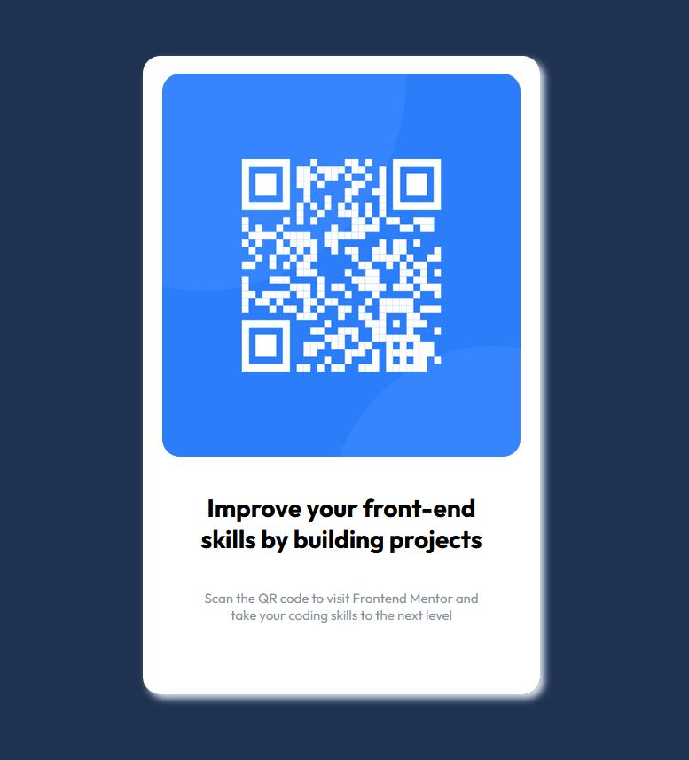

# Frontend Mentor - QR code component solution

This is a solution to the [QR code component challenge on Frontend Mentor](https://www.frontendmentor.io/challenges/qr-code-component-iux_sIO_H). Frontend Mentor challenges help you improve your coding skills by building realistic projects. 

## Table of contents

- [Overview](#overview)
  - [Screenshot](#screenshot)
  - [Links](#links)
[Built with](#built-with)
[Continued development](#continued-development)

## Overview

### Screenshot

### Links

- Solution URL: [Add solution URL here](https://github.com/farrukh-ahm/qr-display/blob/main/index.html)
- Live Site URL: [Live Website](https://farrukh-ahm.github.io/qr-display/)

### Built with

- Semantic HTML5 markup
- CSS custom properties
- Flexbox
- Mobile-first workflow

### Continued development

This is a very basic website with very few components. I'll be practicising more and design more complex website as a part of my ever-growing portfolio.
